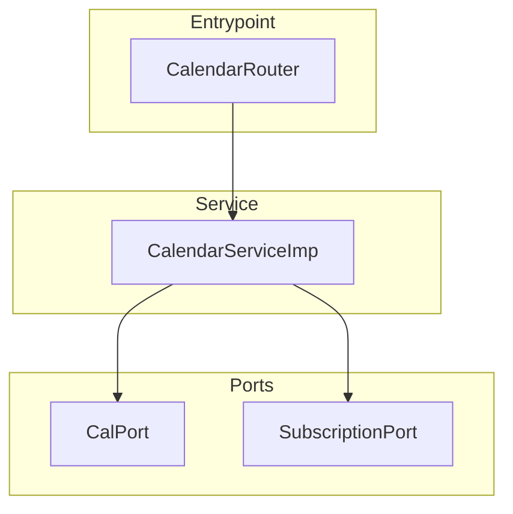
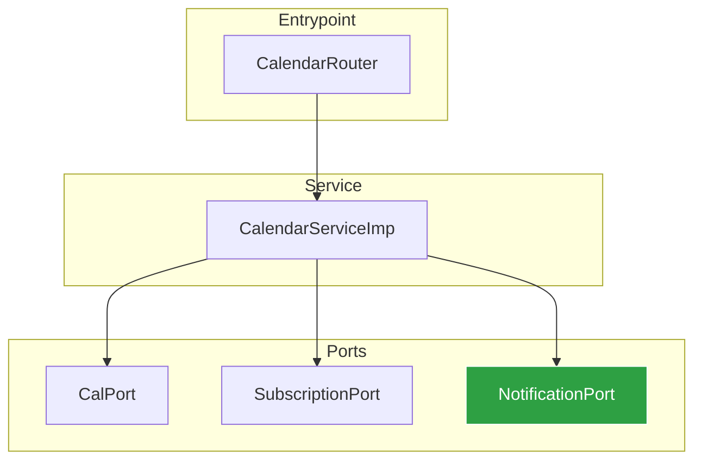

## PR — Push & Create Pull Request

**Purpose**: Push the current branch and create or update a PR with architecture diagrams. Runs `/review --fix` as a mandatory quality gate before any push.

---

### Steps

#### 1 — Verify & Resolve Conflicts

1. **Verify branch** — MUST NOT be `main`/`master`:
   ```bash
   git branch --show-current
   ```
   If on `main`/`master`, **STOP** and tell the caller to run `/worktree init` first.

2. **Check for uncommitted changes** — if any exist, warn and ask whether to commit first (suggest `/commit`).

3. **Fetch and check base**:
   ```bash
   git fetch origin
   ```

4. **Determine base branch**: Use `--base` if provided, default to `main`. Fall back to `master` if `main` doesn't exist.

5. **Check for merge conflicts with base**:
   ```bash
   git merge --no-commit --no-ff origin/<base> 2>&1
   ```
   - **If clean** (no conflicts): abort the test merge and continue:
     ```bash
     git merge --abort
     ```
   - **If conflicts detected**: abort the test merge, then resolve:
     ```bash
     git merge --abort
     git rebase origin/<base>
     ```
     - If rebase has conflicts, resolve them file by file (read the conflicted files, apply the correct resolution, `git add` each resolved file, then `git rebase --continue`).
     - If conflicts are too complex to resolve automatically, abort the rebase (`git rebase --abort`) and ask the user for guidance.

#### 2 — Quality Gate (invoke /review)

**MANDATORY — BLOCKING. No exceptions.**

Invoke the `/review` skill with auto-fix enabled:

```
/review --fix --package <affected-packages>
```

This runs all four checks in order:
1. **fmt** — format and lint (auto-fixes formatting issues)
2. **test** — run full test suite (delegates to test-expert agent for test code fixes)
3. **coverage** — validate coverage thresholds (delegates for missing tests)
4. **rules** — check coding standards (reports violations)

**Gate result handling:**

| `/review` result | Action |
|-----------------|--------|
| PASSED | Proceed to step 3 (push) |
| PASSED with warnings | Proceed — include warnings in PR body |
| BLOCKED | **STOP**. Report failures. Do NOT push. Ask user how to proceed |

#### 3 — Push

Only after `/review` passes:

```bash
git push -u origin <branch-name>
```

- If push is rejected after rebase (history diverged), use `git push --force-with-lease` (safer than `--force`).

#### 4 — Analyze Full Diff

1. Run `git diff origin/<base>...HEAD` to capture ALL changes from the base branch.
2. Run `git log origin/<base>..HEAD --oneline` to see ALL commits on this branch.
3. Identify:
   - **Modified files**: List all files changed with their layer/module (as defined by the project's architecture)
   - **Change type**: `feat` | `fix` | `refactor` | `test` | `docs` | `chore` | `perf`
   - **Affected components**: Which services, ports, adapters, models are touched
   - **Scope**: Infer from the most affected domain

#### 5 — Generate Architecture Diagrams

##### Determine Diagram Types

| Change Type | Diagram |
|------------|---------|
| New service/port/adapter | Component diagram (before + after) |
| Modified components | Component diagram (before + after) |
| Tests only / docs only | Skip diagrams |

##### Component Diagram

Read the affected files and their dependencies to generate:

**BEFORE (current state on base):**


**AFTER (with changes):**


**Rules for component diagrams:**
- Group by architectural layer (as defined by the project — e.g. Entrypoint/Service/Ports/Adapters/Domain, or Controllers/Services/Models, or components/composables/stores)
- Show dependency arrows (who depends on whom)
- Highlight NEW components with `:::new` (green)
- Highlight MODIFIED components with `:::modified` (yellow)
- Highlight REMOVED components with `:::removed` (red)
- Only include components relevant to the change

```
classDef new fill:#2ea043,stroke:#fff,color:#fff
classDef modified fill:#d29922,stroke:#fff,color:#fff
classDef removed fill:#da3633,stroke:#fff,color:#fff
```

##### Modified Files Summary Table

Always generate this table:

```markdown
| File | Layer | Change | Description |
|------|-------|--------|-------------|
| `src/services/calendar.service.ts` | Service | Modified | Added notification call |
| `src/domain/notification.port.ts` | Domain | New | Notification port interface |
```

#### 6 — Create or Update PR

##### Check if PR already exists
```bash
gh pr view --json url,state,title,number,body 2>/dev/null
```

##### If NO PR exists: Create it

```bash
gh pr create --title "<type>(<scope>): <description>" --body "$(cat <<'EOF'
## Summary
- <bullet 1: what changed and why>
- <bullet 2: key implementation detail>
- <bullet 3: testing approach>

## Quality Gate (pre-push validation)
- [x] Code formatted — auto-verified by /review
- [x] Unit tests pass — <N> tests, 0 failures
- [x] Coverage validated — new files: <N>% | no regressions
- [x] Coding standards — <N> rules checked, 0 violations
<warnings if any>

## Architecture Impact

### Component Changes
<component diagram BEFORE>

<component diagram AFTER>

### Modified Files
| File | Layer | Change | Description |
|------|-------|--------|-------------|
| ... | ... | ... | ... |

---
Generated with [Claude Code](https://claude.com/claude-code)
EOF
)"
```

##### If PR ALREADY exists: Update it

1. **Update the title** if the scope has evolved:
   ```bash
   gh pr edit <pr-number> --title "<type>(<scope>): <updated description>"
   ```

2. **Update the body** with fresh diagrams, quality gate results, and summary reflecting ALL commits:
   ```bash
   gh pr edit <pr-number> --body "$(cat <<'EOF'
   <same body structure, regenerated from full diff>
   EOF
   )"
   ```

3. Report the update:
   ```
   PR updated: <pr-url>
   New commits pushed: <count>
   Quality gate: re-validated
   Diagrams: regenerated
   ```

**PR title rules:**
- Conventional commit format: `type(scope): description`
- Max 70 characters
- Imperative mood ("add" not "added")

#### 7 — CI/CD Monitoring

1. Run `gh pr checks <pr-url> --watch --interval 30` to monitor CI (skip if `--skip-ci`).
2. Report results:
   - **All pass**: Report success with PR URL
   - **Any failure**: Show failed check name, fetch logs with `gh run view <run-id> --log-failed`, and suggest fixes

#### 8 — Report

```
PR delivered: <pr-url>
Branch: <branch-name>
Commits: <count>
Quality gate: fmt ✓ | test ✓ (<N> passed) | coverage ✓ (new: <N>%) | rules ✓
CI Status: <passing/failing/skipped>
Diagrams: component (yes/no)
Files changed: <count>
```

---

## Error Handling

| Error | Action |
|-------|--------|
| On `main`/`master` | STOP — tell caller to run `/worktree init` first |
| Uncommitted changes | Warn and suggest `/commit` first |
| `/review` reports BLOCKED | STOP — do not push. Report failures |
| Merge conflicts too complex | Abort rebase, ask user for guidance |
| Push rejected after rebase | Use `git push --force-with-lease` (NOT `--force`) |
| PR already exists | Auto-update: push commits, regenerate title/body/diagrams |
| CI fails | Show failure details, do NOT notify Slack, ask user how to proceed |
| `gh` CLI not available | STOP — `gh` is required for PR creation |

## Important Rules

- **NEVER push without `/review` passing** — this is the primary invariant of this skill
- **NEVER force push** without explicit user confirmation
- **Diagrams must be accurate** — read the actual code to generate them, do not guess
- **Keep diagrams focused** — only show components relevant to the change
- **Worktree-safe**: Works identically from main repo or any worktree
- **PR body always includes quality gate results** — this documents that validation ran
